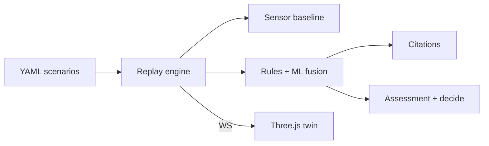

# SentinelFusion

**Industrial safety intelligence that catches compound risk before a single sensor would.**

SentinelFusion is a plant Digital Twin for zero-harm operations. It fuses live process signals, permit-to-work activity, maintenance context, and shift windows into a continuous assessment — then drives a clear decision path when combinations become lethal.

> Data was always there. Coordination was not. SentinelFusion is the missing intelligence layer.

---

## The problem

Heavy industry runs on sensors, SCADA, and permits — yet fatal incidents still emerge from **co-occurring conditions** no individual alarm owns. A gas trend below threshold. A hot-work permit next door. A confined-space entry at shift change. Each system stays green. Together, they write the incident report.

SentinelFusion exists to close that gap: detect the combination, show it on the plant, decide in time, and leave an auditable trail.

---

## What it does

| Capability | Outcome |
|------------|---------|
| **Digital Twin (Demo Mode)** | A living plant view — zones, heat, active permits — as the home screen |
| **Derived facts** | Stable truth extracted from noisy multi-stream events |
| **Compound assessment** | Risk scored from co-occurrence, not single-tag thresholds alone |
| **Decision flow** | Recommend → confirm → execute (block unsafe work, escalate, evacuate with gates) |
| **Baseline proof** | Side-by-side lead time and false-negative reduction vs single-sensor alarms |
| **Regulatory grounding** | Citations from curated industrial guidance attached to critical assessments |

---

## How the brain works

```text
Plant events  →  Context  →  Derived facts  →  Assessment  →  Decision
                     │                              │
                     └──────── live twin UI ────────┘
```

Every critical path is explainable: which facts fired, which factors weighed, which action is recommended, and which guidance supports it.

---

## Product principles

- **Combinations over silos** — the unit of safety is the co-occurrence, not the tag  
- **Spatial by default** — risk without a place on the plant is incomplete  
- **Decisions, not dashboards** — assessment exists to force a next step  
- **Fail visibly** — AI and automation never fail quietly  
- **Prove it** — every demo story ends in measurable lead time  

---

## Architecture (summary)



| Surface | Role |
|---------|------|
| API | Scenario runs, assessments, decisions, health |
| Twin | Real-time plant state over a live channel |
| Simulator | Scripted industrial chronologies for demos and eval |
| Intelligence | Assessment scoring with hard safety guardrails |
| Knowledge | Retrieval-backed citations on critical outcomes |
| Console | Digital Twin · Assessment · Decision |

Details: [`docs/architecture.md`](docs/architecture.md) · Record: [`docs/demo-script.md`](docs/demo-script.md)

---

## Repository

```text
apps/           # API, web console, ML artifacts
packages/       # Scenarios, plant packs, knowledge excerpts
docs/           # Product, architecture, contracts, ADRs
```

| Doc | Purpose |
|-----|---------|
| [`docs/overview.md`](docs/overview.md) | Product overview |
| [`docs/stack.md`](docs/stack.md) | Engineering shape |
| [`docs/architecture.md`](docs/architecture.md) | System design |
| [`docs/demo-script.md`](docs/demo-script.md) | 90–120s demo narration |
| [`docs/deck.md`](docs/deck.md) | Pitch deck outline |
| [`docs/submit-checklist.md`](docs/submit-checklist.md) | Record + submit hand-off |
| [`docs/prd.md`](docs/prd.md) | Requirements |
| [`docs/api.md`](docs/api.md) | API contracts |
| [`docs/data-model.md`](docs/data-model.md) | Canonical types |
| [`docs/decisions.md`](docs/decisions.md) | Architecture decisions |
| [`docs/todo.md`](docs/todo.md) | Build roadmap |

---

## Quick start

```bash
git clone https://github.com/iakshkhurana/sentinelfusion.git
cd sentinelfusion

docker compose up --build
```

| Surface | URL |
|---------|-----|
| Twin console | http://localhost:5173 |
| API health | http://localhost:8000/api/v1/health |
| OpenAPI | http://localhost:8000/docs |

Pick a scenario → **Run scenario** → watch fusion beat the single-sensor baseline → **Block permit** / escalate from the assessment panel.

### Local (without Docker)

```bash
# API
cd apps/api && pip install -r requirements.txt
uvicorn main:app --reload --port 8000

# Web (new terminal)
cd apps/web && npm install && npm run dev
```

### Verify

```bash
# Windows
pwsh scripts/verify.ps1

# Unix
bash scripts/verify.sh

# Metrics table only
python scripts/eval_report.py
```

### Proof (packaged scenarios)

| Scenario | Fusion | Baseline | Lead | Incident |
|----------|--------|----------|------|----------|
| `hot_work_gas_adjacent` | @300s | @420s | +180s | @480s |
| `confined_space_abnormal` | @240s | @390s | +180s | @420s |
| `maint_gas_path_trend` | @270s | @420s | +180s | @450s |
| `simops_shift_handover` | @210s | @330s | +210s | @420s |

Recompute anytime with `python scripts/eval_report.py`.

---

## Evaluation focus

Aligned with industrial safety outcomes that matter in the field:

- Compound detection vs single-sensor baselines  
- Prediction lead time before incident threshold  
- False-negative rate reduction  
- Geospatial evidence quality  
- Regulatory citation relevance  

Demo / submit hand-off: [`docs/submit-checklist.md`](docs/submit-checklist.md) · [`docs/demo-script.md`](docs/demo-script.md) · [`docs/deck.md`](docs/deck.md)

---

## Status

**Code complete / submission-ready** — Compose, 4 scenarios (incl. SIMOPS), agents + ML + cites, scrub rail, emergency playbook, pytest + vitest. Remaining human step: record the 90–120s video (`docs/submit-checklist.md`).

---

## License

Proprietary — all rights reserved unless otherwise stated by the team.

---

<p align="center">
  <strong>SentinelFusion</strong><br/>
  See the combination. Decide before the siren.
</p>
