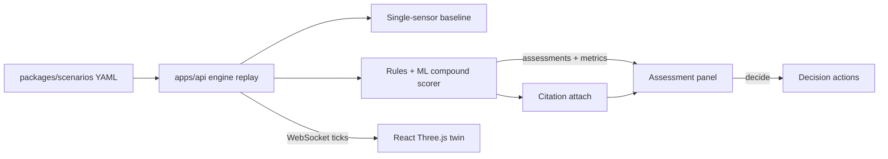

# Architecture — SentinelFusion

Watchable spine: **YAML twin → context → derived facts → assessment → decision SM**, live over **WebSocket**, with **ML + RAG** for score and receipts.

Full stack vibe: [`docs/stack.md`](stack.md)

## Runtime (what runs today)



| Process | Port | Role |
|---------|------|------|
| `api` (uvicorn) | 8000 | Scenarios, replay, WS, decide, model health |
| `web` (nginx) | 5173→80 | Twin UI; proxies `/api` + WS to `api` |

One-command: `docker compose up --build`. Narration beats: [`docs/demo-script.md`](demo-script.md).

## System overview (target spine)

```text
┌─────────────────────────────────────────────────────────────┐
│  YAML Scenario Simulator                                     │
│  gas · permit · maint · shift · compound setups              │
└──────────────────────────────┬──────────────────────────────┘
                               │ plant events
                               ▼
┌─────────────────────────────────────────────────────────────┐
│  Context Engine                                              │
│  windowed plant truth · adjacency · active PTW set           │
└──────────────────────────────┬──────────────────────────────┘
                               │
                               ▼
┌─────────────────────────────────────────────────────────────┐
│  Derived Facts                                               │
│  gas_elevated · hot_work_adjacent · confined_entry · …       │
└──────────────────────────────┬──────────────────────────────┘
                               │
                               ▼
┌─────────────────────────────────────────────────────────────┐
│  Assessment Pipeline                                         │
│  rule guardrails + ML scorer + factor explanations           │
│  baseline single-sensor path (for A/B proof)                 │
└──────────────────────────────┬──────────────────────────────┘
                               │
                               ▼
┌─────────────────────────────────────────────────────────────┐
│  Decision State Machine                                      │
│  assessing → recommended → awaiting_decision                 │
│       → confirmed | dismissed → executing → done             │
└───────────────┬─────────────────────────────┬───────────────┘
                │                             │
                ▼                             ▼
     WebSocket bus                     RAG attach
     twin · facts · assessment         citations on CRITICAL
     decision · metrics · ai.error
                │
                ▼
┌─────────────────────────────────────────────────────────────┐
│  React Digital Twin (Demo Mode)                              │
│  Three.js plant · Assessment panel · Decision flow           │
└─────────────────────────────────────────────────────────────┘
```

## Module map

| Module | Responsibility |
|--------|----------------|
| **Simulator** | Replay YAML events onto the twin clock |
| **Context engine** | Normalize + window multi-stream state |
| **Derived facts** | Boolean/graded facts the rest of the system reasons over |
| **Assessment** | Compound risk score, severity, factors, baseline compare |
| **Decision SM** | Turn assessment into gated operational action |
| **AI provider** | Mock or real LLM for structured narrative / hints |
| **RAG** | Vector cites from Postgres/pgvector |
| **WS hub** | Fanout to all UI surfaces |

## Decision state machine

```text
idle → assessing → recommended → awaiting_decision
                                      ├─ confirmed → executing → done
                                      └─ dismissed → archived
```

- `block_permit` may auto-confirm in Demo Mode  
- `evacuate` always stops at `awaiting_decision` until human confirm  

## AI provider

| Setting | Behavior |
|---------|----------|
| `AI_PROVIDER=mock` | Deterministic structured JSON (default for tests) |
| `openai` / `ollama` | OpenAI-compatible client |
| Contract | Pydantic structured out · **1 retry** · then visible `ai.error` |

## ML

- Features from derived facts + windows  
- Scorer cannot downgrade rule-forced CRITICAL  
- Eval harness: lead time + FN vs baseline on YAML scenarios  

## Stack table

| Layer | Choice |
|-------|--------|
| API | FastAPI + Pydantic v2 |
| DB | Postgres + pgvector |
| Realtime | WebSocket broadcast |
| Scenarios | YAML |
| UI | React + Vite + TS · SVG twin |
| ML | scikit-learn / LightGBM |
| AI | Mock \| OpenAI-compatible \| Ollama |
| Package | `uv` + `pnpm` |
| Ops | Docker Compose |

## Guardrails

- No silent AI failure  
- No unconfirmed evacuate  
- Docs (`data-model`, `api`) stay source of field truth  
